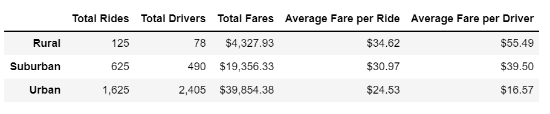
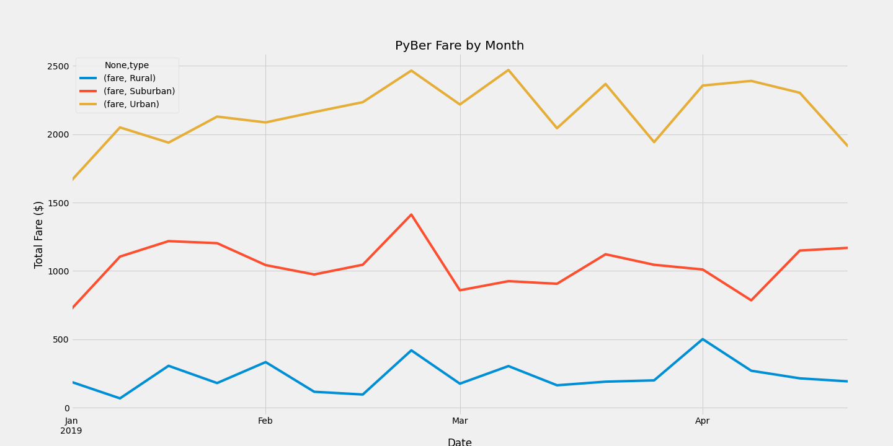

# PyBer Ride Share Analysis
## Overview
Interested in improving their services, PyBer needs to understand how well their company operated in different city settings. The project relied on data collected in 2019, and used Python's Pandas and Matplotlib libraries to conduct the analysis. Analysis consisted of observing city type's number of drivers, trips, and fares throughout the year. 
### Objective
Visualize the ride share data based on city type to highlight discrepancies between the three categories: urban, suburban, rural. 
## Results
### City Type Analysis
The PyBer data summary DataFrame (Fig 1) displays the city type summary for rides, drivers, and fares.

* Moving from rural to urban, the driver and rider count increases, as do the total fares.  
	* There is a noticeable jump of drivers from Rural and Suburban compared to Urban,  more extreme than the increase of total rides between the three categories.
	* A rural driver averages 1.6 rides, suburban 1.2, and an urban driver averages .68 rides. 
* Assuming same rate per mile, rural drivers typically have longer rides. Urban drivers make $10/ride less than rural. 
* Due to the number of rides vs the number of drivers, rural drivers tend to make more money overall.  Urban drivers average almost $40 less overall. 

### Q1 Analysis - Total Fare ($)
Urban's, Suburban's and Rural's first quarter total fares by week were plotted with time on the x-axis, and total fares on the y-axis. 

*  There is about a $1000 step between each category's weekly total. As noted in the DataFrame summary, the profit increases the closer to the urban center.
* There is a peak for all three city types towards the end of February that may indicate an event in the region. 
* Overall, each category trends flat within a $500 range. 
	* The urban fares are much more volatile on a weekly basis. 
* Both Urban and Suburban had lower than average starts in the first week of 2019 

## Summary
Analyzing the summary and fare totals, recommendations include the following.
1. Focus on the urban and suburban areas.  These locales are what drive the profits, and have the most need for ride shares.  Keep monitoring the rural areas to ensure there is not a supply or demand issue; however, spend more time and money on the urban areas. 
2. Research the spike in late February and capitalize on the findings.  The timing and magnitude of the spikes correlate, which could be created by a regional event, successful advertising, a promotional discount, etc.  If understood, PyBer could promote similar tactics to increase fares. 
3. Increase the ride to driver ratio in the urban area.  By being more consistent on a weekly basis can help raise this number.  By increasing this number, the average fare per driver would increase, which implies more satisfied drivers. 
